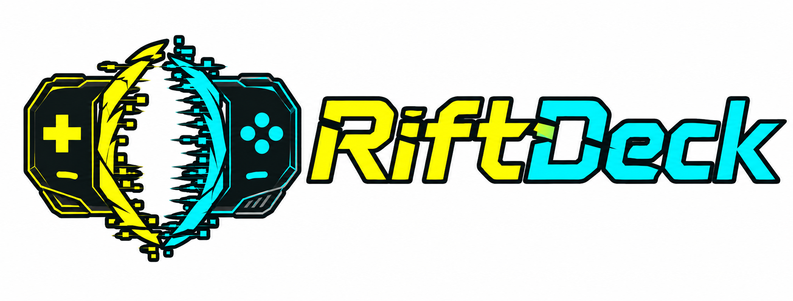
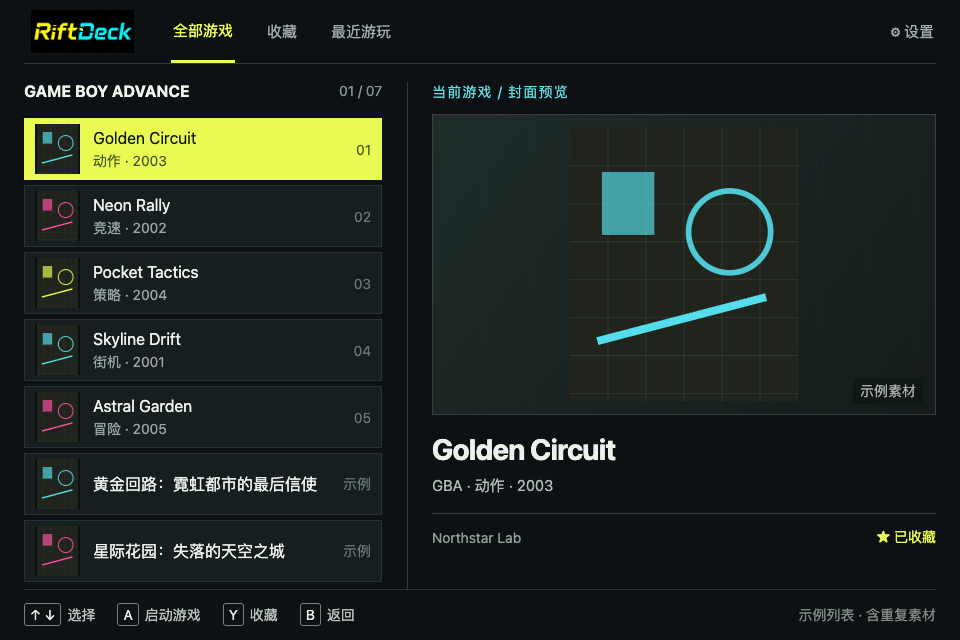

# RiftDeck

**简体中文** | [English](README.en.md)

  

**为 KPA 打造，手柄优先的复古游戏前端。**

RiftDeck 是专为 KPA（KONKR Pocket Advance）打造的开源游戏库与模拟器前端。用方向键、摇杆和手柄按钮浏览游戏、管理收藏，再通过外部模拟器启动。

目前正在积极开发，优先支持 **Game Boy Advance**。核心功能无需账号，ROM 保留在本地。

## 界面预览

新版首页采用紧凑的左右分栏：左侧浏览游戏，右侧展示封面与资料，顶部切换全部游戏、收藏和最近游玩。以下预览使用示例游戏库和占位封面。

## 核心功能

* 手柄优先：首页、游戏库、详情与设置，支持分类切换和快速翻页。
* 本地游戏库：扫描 `.gba` / `.zip`，支持增量更新、搜索、排序和本地封面。
* 收藏与最近游玩：记录启动次数和估算时长，返回时恢复选中项与滚动位置。
* 外部模拟器：选择并保存配置，已验证 GBA.emu 启动流程。
* 个性化：深浅色外观、多套配色、减少动态效果，可设为 Android 默认桌面。

## 快速开始

1. 安装 RiftDeck 和兼容的 GBA 模拟器。
2. 选择 **添加 ROM 文件夹**，授予访问权限。
3. 在 **设置 → 模拟器** 中选择已安装的模拟器，然后选择游戏启动。

ZIP 中须只包含一个 GBA ROM。存档目录请在模拟器中配置；RiftDeck 不管理存档。本地封面可与 ROM 同名放置，例如 `Game.gba` 和 `Game.png`，然后重新扫描。

## 更多文档

* [使用与开发指南](GUIDE.md)：详细功能、使用限制、架构、构建与路线图。
* [实现与验证记录](CORE_IMPLEMENTATION.md)：验证证据和待完成的硬件检查。
* [自动化测试](.github/CI.md)：CI 检查范围、测试报告与本地运行方法。
* [开发规范](AGENTS.md)：参与贡献前请先阅读。

## 许可与版权

源代码采用 [MPL-2.0](LICENSE)；名称、Logo 和应用图标等品牌资产适用独立的[商标规则](TRADEMARKS.md)，不包含在 MPL-2.0 授权中。未经授权，修改版和分叉项目不得冒充官方发行版。

RiftDeck 不包含模拟器核心，也不提供、托管、下载或分发受版权保护的 ROM 或 BIOS。请确保游戏文件的获取和使用符合适用法律与许可条款。
