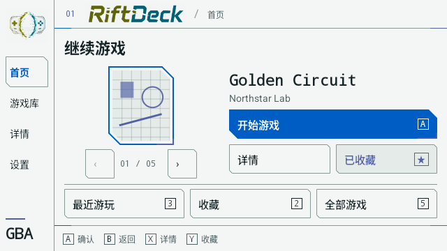
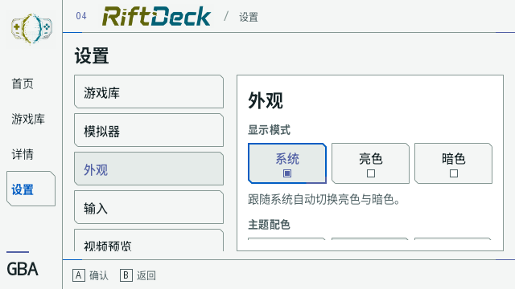
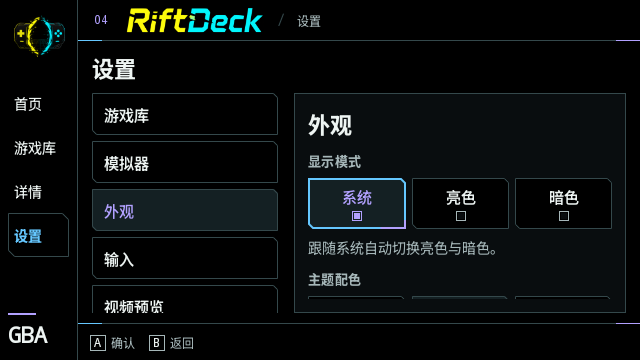
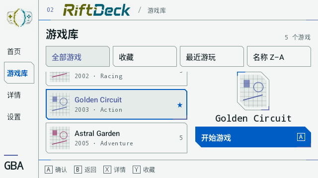
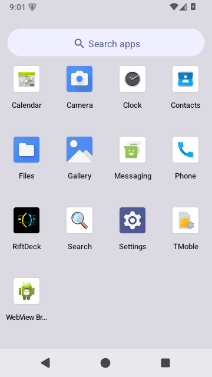

# Theme and icon update

Settings → Appearance now offers System (default), Light and Dark modes, with independent Rift, Ocean and Ember palettes. DataStore saves both choices alongside the existing motion and sorting preferences.

Library rows, library filters and settings choices share the same cut-corner focus frame. Touch selection retains visible focus. D-pad navigation moves focus without changing the saved theme until A is pressed.

Light mode uses dedicated emblem and wordmark artwork. The Android launcher uses the RiftDeck emblem in an adaptive icon, with a separate monochrome layer. Asset briefs and final image-generation prompts are recorded in [brand-light.prompts.json](assets/brand-light.prompts.json).

## Validation

- Debug build and all 14 unit tests pass; Lint reports 0 errors and 2 dependency-version warnings.
- All six mode/palette combinations pass text contrast and focus visibility checks.
- Android emulator checks cover system day/night changes, fixed modes ignoring system changes, saved preferences after restart, process restoration, and retained rail/option focus.
- Controller checks cover category entry, theme options, library-to-detail return, repeated navigation and launch dialogs.
- Layouts checked at 640 × 360 and 640 × 480, with English and Chinese text and 130% font size.
- The updated APK is installed on the connected Android phone. Testing on the target handheld remains outstanding.

## Screenshots

